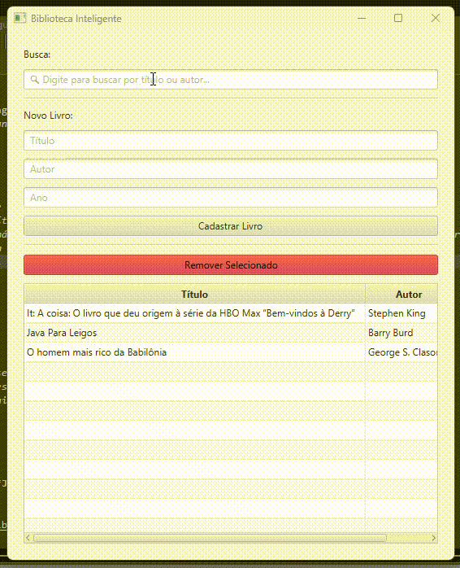

# 📚 Gerenciador de Biblioteca Java

Um sistema desktop completo para gerenciamento de acervo, desenvolvido para demonstrar conceitos avançados de Orientação a Objetos, persistência de dados e interfaces gráficas.

---

## 📸 Demonstração do Sistema


*Interface desenvolvida com JavaFX, apresentando cadastro e listagem em tempo real.*

---

## 🚀 Funcionalidades Principais

* **Interface Gráfica (GUI):** Experiência de usuário intuitiva utilizando JavaFX.
* **Gestão de Acervo:** Cadastro completo (Título, Autor, Ano) e remoção de livros.
* **Persistência de Dados:** Salvamento automático em arquivo `.txt`, garantindo que os dados não sejam perdidos ao fechar o programa.
* **Validação de Dados:** Filtros que impedem o cadastro de campos vazios ou anos inválidos.
* **Busca Inteligente:** Filtro em tempo real por Título ou Autor utilizando FilteredList.

---

## 🛠️ Tecnologias e Conceitos Utilizados

* **Linguagem:** Java 21.
* **Interface:** JavaFX (SDK 21).
* **Estruturas de Dados:** `ArrayList` e `ObservableList` para sincronização com a UI.
* **Paradigma:** Orientação a Objetos (Classes, Encapsulamento e Métodos).
* **I/O (Input/Output):** Manipulação de arquivos com `PrintWriter` e `BufferedReader`.

---

## 📁 Como Executar o Projeto

1.  Certifique-se de ter o **Java 21** e o **JavaFX SDK 21** instalados.
2.  Clone este repositório:
    ```bash
    git clone [https://github.com/axp-work/biblioteca-java.git](https://github.com/axp-work/biblioteca-java.git)
    ```
3.  Configure o `--module-path` para a pasta `lib` do seu JavaFX no seu ambiente de execução (VS Code ou Terminal).
4.  Execute a classe `InterfaceGrafica.java`.